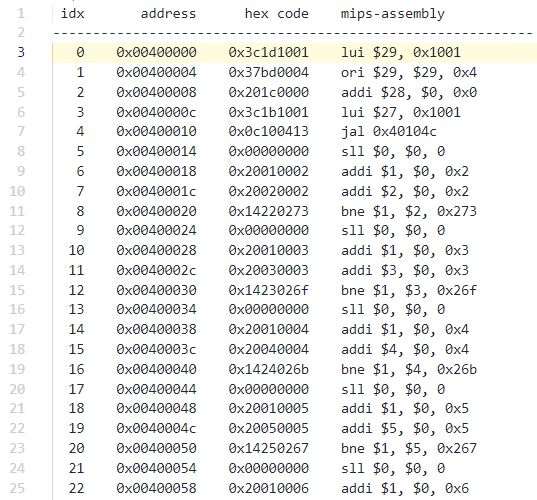

# Mips-Disassembler.py

## 一、这是啥？

大二暑假当时写了个 54 条 `mips` 指令的单周期 `CPU`，当时写的头昏眼花。

但头昏眼花并不是因为 `vivado 2016` 极其糟糕的 `UI` 设计，也不是因为我本人阅读波形图能力存在缺陷，更不是因为暑假心思没有放在课程设计上。

而是因为学校 `mips246` 网站上只提供了 54 条指令的测试机器码（用于初始化 `IP Core` 的 `coe` 文件），却没有给出其对应的 `mips` 汇编代码。由此，我一度培养出了人脑 `mips` 反汇编的能力。

但是很可惜，这个对我来说 **完全没有必要培养出来的能力** 被 `ddl` 后的第一个大懒觉残忍地抹杀了。

## 二、其实我知道

机器码到汇编码的转换，在 `GitHub` 中就有许多仓库，并且世界上有太多太多的反汇编工具。

但是能不能产生做作业时需要的用来 `debug` 的指令却是另外一件事。

## 三、但仅仅是这样

还是有一些东西我自我感觉很难处理，比如标号……

所以就先这样吧，其他有时间再说。

## 四、一开始居然忘了

### 1. 使用方法

```shell
python main.py -d file_path_to_disassembly -o output_file_path
```

要注意这里的输入文件不是简单的 `*.coe` 文件，需要把正常 `*.coe` 文件前两行去掉！

### 2. 使用例

```bash
-----
    |---main.py
    |---tools
    |---mips_31_mars_simulate.txt
```

需要注意的是这里的输入为：


没有前面两行的：

```txt
memory_initialization_radix = 16;
memory_initialization_vector =
```

还请认真比较与真正的 `*.coe` 文件的差别：


之后切换到 `main.py` 所在路径下，在终端运行：

```shell
python main.py -d mips_31_mars_simulate.txt -o output.txt
```

短暂地运行后，当前目录就会有非常 `nice` 的输出文件啦！


